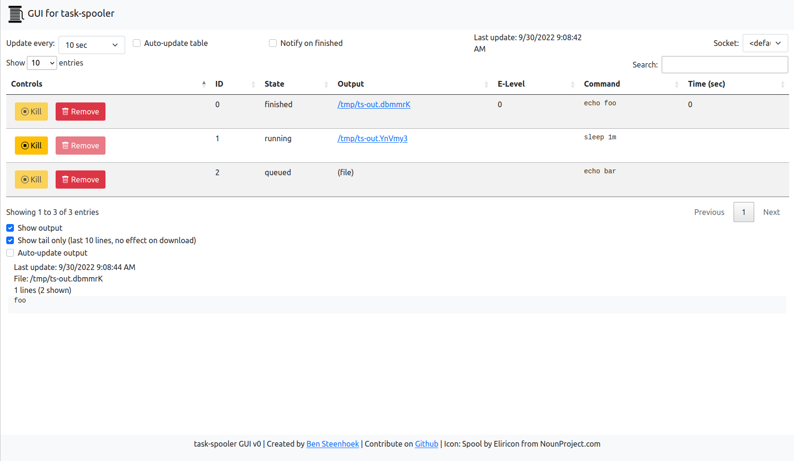

# task-spooler GUI

A web-based GUI for task-spooler, for easy monitoring/access.



# Setup

Install dependencies.

```bash
python3 -m venv .env && \
source activate.sh && \
pip install -r requirements.txt
```

# Run

Run these commands or use `tsp-gui`.

```bash
source activate.sh
flask run
```

# Attribution

Icon: Spool by Eliricon from NounProject.com
https://thenounproject.com/icon/spool-447490/
