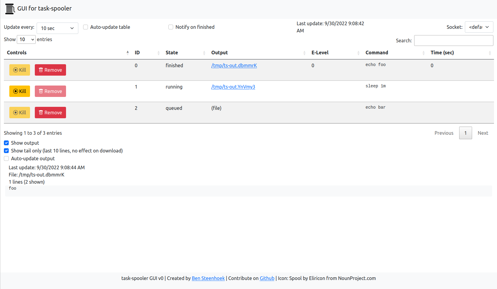

# task-spooler GUI

A web-based GUI for task-spooler, for easy monitoring/access.



# Setup

```bash
# First, clone and enter this repository
git clone https://github.com/bstee615/task-spooler-gui && cd task-spooler-gui

# Install dependencies
bash scripts/install_env.sh

# If you plan to access the GUI remotely,
# then uncomment the host line in src/task_spooler_gui/__main__.py
# This may have security implications.

# Set up persistent service
bash scripts/install_service.sh
```

# Run

```bash
# This is the same script used by install_service.sh
bash scripts/serve.sh
```

# Attribution

Icon: Spool by Eliricon from NounProject.com
https://thenounproject.com/icon/spool-447490/
